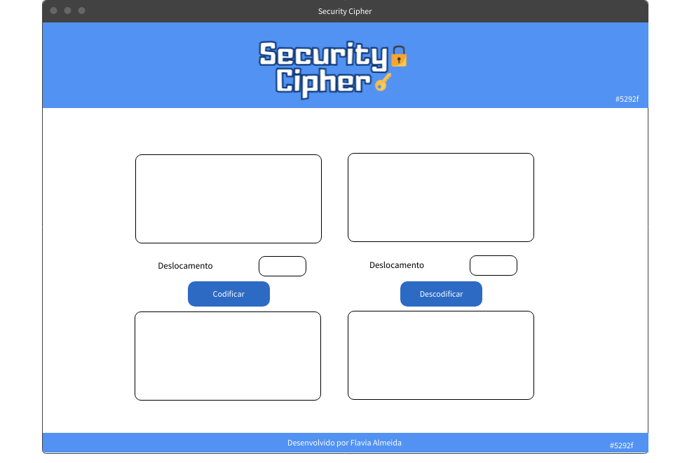

#  :lock: Security Cipher :key:

A aplicação web desenvolvida para criptografar / descriptografar mensagem.

:open_file_folder: Para abrir [clique aqui](https://flavia-dantas.github.io/SAP007-cipher/)

## :book: Índice

- [:lock: Security Cipher :key:](#lock-security-cipher-key)
  - [:book: Índice](#book-índice)
  - [:memo: Prefácio](#memo-prefácio)
  - [:computer: Projeto](#computer-projeto)
    - [Interface do usuário (UI)](#interface-do-usuário-ui)
        - [Criptografar:](#criptografar)
        - [Descriptografar:](#descriptografar)
    - [:bulb: Layout](#bulb-layout)
  - [:gear: Tecnologias](#gear-tecnologias)

## :memo: Prefácio

Cifrar significa codificar. A [cifra de César](https://pt.wikipedia.org/wiki/Cifra_de_C%C3%A9sar)
é um dos primeiros tipos de criptografias conhecidas na história.
O imperador romano Júlio César utilizava essa cifra para enviar
ordens secretas aos seus generais no campo de batalha.

A cifra de César é uma das técnicas mais simples de cifrar uma mensagem. É um
tipo de cifra por substituição, em que cada letra do texto original é
substituída por outra que se encontra há um número fixo de posições
(deslocamento) mais a frente do mesmo alfabeto.

Por exemplo se usarmos o deslocamento (_offset_) de 3 posições:

- Alfabeto sem cifrar: A B C D E F G H I J K L M N O P Q R S T U V W X Y Z
- Alfabeto com cifra: D E F G H I J K L M N O P Q R S T U V W X Y Z A B C
- A letra A será D
- A palavra ABACATE será DEDFDWH

Atualmente todas as cifras de substituição alfabética simples, são decifradas
com facilidade e não oferecem muita segurança na comunicação por si mesma,
mas a cifra de César muitas vezes pode fazer parte de um sistema
mais complexo de criptografia, como
a cifra de Vigenère, e tem aplicação no sistema ROT13.

## :computer: Projeto

O [Security Cipher](https://flavia-dantas.github.io/SAP007-cipher/) foi desenvolvido para atender o público que necessita de segurança e privacidade. Através da aplicação web é possível escrever mensagens e criptografar transformando de forma secreta e segura. A mensagem é protegida por meio de criptografia pode ser lida somente com a chave correta (deslocamento da letra).  

### Interface do usuário (UI)

A interface permite ao usuário:

##### Criptografar:

- Digitar uma mensagem (texto) para ser cifrada.
- Eleger um _offset_ indicando quantas posições de deslocamento de caracteres
  quer que a cifra utilize.
- Clicar no botão Cifrar.
- Ver o resultado da mensagem cifrada

##### Descriptografar:

- Digitar uma mensagem (texto) para ser decifrada.
- Inserir o mesmo _offset_ ultilizado na criptografia indicando quantas posições de deslocamento de caracteres para decifrar.
- Clicar no botão Decifrar.
- Ver o resultado da mensagem decifrada.

### :bulb: Layout

As cores do definadas foram o azul e branco. O azul transmite a ideia de **calma, serenidade e tranquilidade**. Por esse motivo, costuma ser comum o seu uso para representar profissionalismo, estabilidade e segurança.

O protótipo foi criado no [mockflow](https://mockflow.com/). O primeiro protótipo foi apenas desenhado as caixas de texto e os botões. Após escolher as cores do site foi realizado o layout abaixo e logotipo.

## :gear: Tecnologias

Para desenvolvimento do projeto foram utilizados:

- HTML

- CSS

- JavaScript

- Node.js
